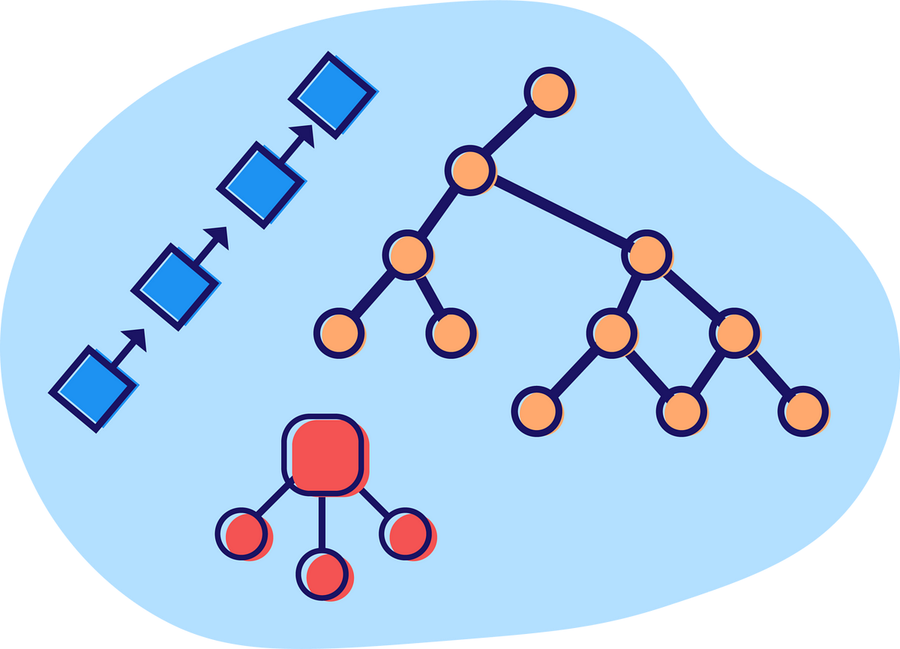

# &nbsp; Learn Everything about JavaScript

Comprehensive knowledge, learning resources, and practice materials for mastering JavaScript.

 

## Fundamental

- Conditional Statements

 

 

## Data Structures

- Primitive Types
    - Boolean
    - Number
    - BigInt
    - String
    - Symbol
    - Null
    - Undefined
- Non-Primitive Types
    - Object
    - Array

## Design Patterns

## Object Oriented Programming

## Algorithms

